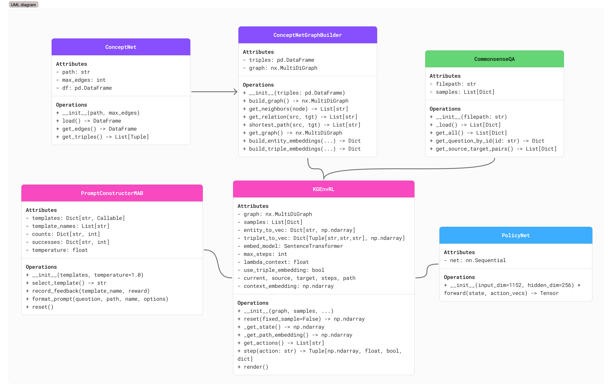

# 🧠 Graph-based Reasoning for Question Answering

This repository contains the implementation of **KnowGPT** with enhancements for **Commonsense Question Answering (QA)**, integrating **ConceptNet** knowledge graph, **Deep Reinforcement Learning (PRL)**, and **Multi-Armed Bandit (MAB)**-based prompt optimization.

📌 Paper Reference:  
Zhang et al., *KnowGPT: Knowledge Graph based Prompting for Large Language Models*, NeurIPS 2024.  
[Original Repo](https://github.com/GraphPrompting/KnowGPT)  

---

## 🚀 Overview

Hallucination remains a major challenge for Large Language Models (LLMs) in knowledge-intensive QA tasks. This project aims to reduce hallucination and improve reasoning by using:

- **Knowledge Graphs (ConceptNet 5.7)** for factual grounding  
- **Graph-based path reasoning** with Reinforcement Learning  
- **Adaptive prompt construction** using Multi-Armed Bandit  
- **Hierarchical Prompting Taxonomy (HPT)** for structured prompts  

Target dataset: **CommonsenseQA**  
LLM: GPT-3.5 / GPT-4 (via OpenAI API)

---

## 🛠️ Installation

**Requirements:**

- Python 3.8+
- `transformers`
- `sentence-transformers`
- `networkx`
- `scikit-learn`
- `openai`

```bash
git clone https://github.com/PhungHaThiKim/GraphRAG.git
cd GraphRAG
pip install -r requirements.txt

Notes: You must also export your OpenAI API key!

📦 System Architecture
The project is structured into modular components:

- `ConceptNetGraphBuilder`: Builds the knowledge graph (as a MultiDiGraph) from ConceptNet triples.
- `KGEnvRL`: Defines a custom RL environment over the KG for path reasoning.
- `PolicyNet`: A neural policy network that learns to select paths toward target answers.
- `PromptConstructorMAB`: Manages multiple prompt templates and selects the best one using multi-armed bandit strategy.

👉 The overall architecture of these core classes and their interactions is illustrated in the UML diagram below:

